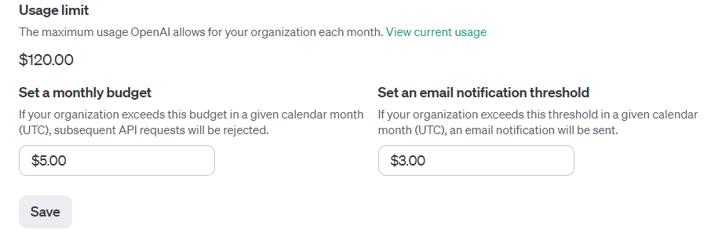

# PythonOpenAILangChainBot
## מדריך ליצירת בוט בסיסי בעזרת פייתון

במדריך הזה ניצור בוט בסיסי בעזרת פייתון 3.12, OpenAI, LangChain וStreamlit וכמובן איך אפשר בלי באמת לשחרר אותו לעולם, נעשה לו דיפלוי בHugging Face
המדריך יהיה בHigh Level ולא ירד לפרטי פרטים על איך הLLM עובד, המטרה של המדריך הזה היא להרים בוט בסיסי בזריזות, למי שכבר יש ידע כלשהו בתכנות, כלומר זה מאוד אבסטרקטי.

---
# הכנת סביבה
יאאלה נתחיל בהכנות! (אני יוצא מנקודת הנחה שכבר התקנתם פייתון כמובן)

נתחיל מליצור סביבה וירטואלית כדי שנעבוד עליה באופן זמני (זמני בגלל שבדיפלוי אין בה צורך, HuggingFace ידאגו לנו)

בשביל זה נצטרך להתקין virtualenv בעזרת

`pip install virtualenv`  

ברגע שעשינו את זה, ניצור תיקיה ריקה, ובתוכה נריץ

`virtualenv venv`

נפעיל אותה בטרמינל שלנו בעזרת

`.\venv\Scripts\activate`

זה אמור להראות ככה:


לאחר מכן ניצור את קובץ הדרישות שלנו, במקרה שלנו התוכן צריך להיות:

`requirements.txt`:
```
python-dotenv==1.0.1
langchain-openai==0.0.3
streamlit==1.30.0
```

ונתקין את הדרישות בעזרת

`pip install -r requirements.txt`

זה יכול לקחת כמה שניות

ברגע שההתקנות הסתיימו, אנחנו צריכים לקבל API KEY של OpenAI בשביל שנוכל להשתמש בהם.

במידה ואין לכם משתמש בOpenAI אתם צריכים ליצור משתמש בקישור הזה - https://platform.openai.com/api-keys


אתם תצטרכו ליצור משתמש, ולהרשם כמשתמש *לא חינמי*  תשימו את המחיר הכי סמלי שקיים שם (לפחות בזמן יצירת המדריך הזה, שזה 5$)
ואל תשכחו להגביל את השימוש בקישור הזה - https://platform.openai.com/account/limits


אחרי המשתמש שלנו מוכן, אנחנו נחזור לקישור שוב, וניצור לנו API KEY - 


שימו לב! ברגע שתיצרו את המפתח, תעתיקו אותו, כי לא תוכלו לראות אותו שוב.

ברגע שהעתקנו את המפתח, ניצור קובץ בשם .env ונעתיק לתוכו את הקוד, תחת שם כלשהו, אני בחרתי לעשות זאת ככה - 
 *וכמובן, המפתח שלכם חייב להשאר בסוד וגלוי רק לכם

`.env`:
```
OPENAI_API_KEY="sk-קוד סופר דופר סודי"
```

אחרי זה ניצור משתמש בHuggingFace, וניצור שם ספייס חדש.

1. תצרו משתמש כאן - https://huggingface.co/join 
2. תצרו ספייס חדש כאן - https://huggingface.co/new-space 
    - תבחרו שם לפרוייקט שלכם
    - תבחרו בstreamlit בתור הSDK
    - תבחרו את הגירסא החינמית כמו בתמונה
   

לאר מכן יהיה לכם ספייס מוכן, בתוכו אנחנו נאכס את הקוד והאפליקציה, והם ידאגו לנו לכל לדיפלויימנט והכל.

תוכלו לעבור לטאב של files כדי לראות את הקבצים, תוכלו לשים לב שזה ממש דומה לגיטהאב.


יאאלה, סיימנו עם ההכנות, נעבור לקוד!

---

# יצירת הבוט

 ניצור הקובץ לסקריפט שלנו - `app.py`  
שימו לב, שהשם של הקובץ משנה, הסיבה לכך, היא HuggingFace יריצו את האפליקציה של סטרימליט בשם הזה, זאת הקונבנציה.

קודם נעשה אימפורטים לכל מה שאנחנו נצטרך (שימו לב, יש 2 שלבים, בראשונה נריץ את זה על המחשב שלנו לוקאלית, ואז נוריד מה שלא צריך בשביל שמה שנריץ בhuggingface יהיה נקי)
 
`app.py`:

```
from langchain_openai import OpenAI
from dotenv import load_dotenv
import streamlit as st
import os
```

`langchain_openai` - יעזור לנו בעצם להתחבר ל OpenAI  
`dotenv` - יתן לנו את האופציה לטעון את המפתח בצורה בטוחה  
`streamlit` - ספריה מעולה ליצירת אפליקציות כמו שלנו, דרך ממש מהירה ופשוטה ליצור אפליקציות ווב בעזרת פייתון  

נתחיל מלתת כותרת לאפליקציה שלנו, ולבחור מודל שמולו אנחנו רוצים לעבוד, וכמובן טען את המשתנה הסביבתי שלנו שזה בעצם המפתח (dontenv דואג לנו בשורה אחת)
```
st.set_page_config(page_title="My AWESOME Bot!")
MODEL = "gpt-3.5-turbo-instruct"
load_dotenv()
```

אתם מוזמנים לבחור מודל אחר כאן במידה ותרצו: 
https://platform.openai.com/docs/models/overview

נוסיף פונקציה שתדאג לטעון את המודל שלנו כשהאפליקציה עולה

```
def get_model(model_name: str) -> OpenAI:
    return OpenAI(
        openai_api_key=os.getenv("OPENAI_API_KEY"),
        model=model_name,
        temperature=0.5
    )
```

 לגבי `temperature` הפרמטר הזה מגדיר לנו כמה אנחנו מסכימים למודל  "להזות" מוזמנים לקרוא על כך כאן - https://deepchecks.com/glossary/llm-parameters/#:~:text=LLM%20Temperature&text=A%20higher%20temperature%20value%20typically,to%20the%20most%20likely%20prediction.
 
אחר כך, ניצור פונקציה שתקבל את האינפוט של המשתמש, ותחזיר תשובה מLLM שלנו.

```
def get_openai_response(open_ai_llm: OpenAI, question: str):
    if question:
        response = open_ai_llm.invoke(question)
        return response
```
הפונקציה מקבלת את המודל שיצרנו, ואת אנינפוט של המשתמש.

לאחר מכן נקראה ליצירת המודל

`openai_llm = get_model(MODEL)`

לאחר מכן, ניצור form בעזרת סטרימיט.

```
with st.form("bot_form"):
    user_input = st.text_input(label="I Wanna ask...")
    ask = st.form_submit_button("Ask!")

    if ask:
        response = get_openai_response(openai_llm, user_input)
        st.write(response)
```

עד כה, הקוד אמור להראות ככה:

```
from langchain_openai import OpenAI
import streamlit as st
from dotenv import load_dotenv
import os

st.set_page_config(page_title="QA Bot")
MODEL = "gpt-3.5-turbo-instruct"
load_dotenv()


def get_model(model_name: str) -> OpenAI:
    return OpenAI(
        openai_api_key=os.getenv("OPENAI_API_KEY"),
        model=model_name,
        temperature=0.5
    )


def get_openai_response(open_ai_llm: OpenAI, question: str):
    if question:
        return open_ai_llm.invoke(question)


openai_llm = get_model(MODEL)

with st.form("bot_form"):
    user_input = st.text_input(label="I Wanna ask...")
    ask = st.form_submit_button("Ask!")

    if ask:
        response = get_openai_response(openai_llm, user_input)
        st.write(response)

```

עכשיו אפשר להריץ את זה!

`streamlit run app.py

ברגע שהרצתם, אם לא נפתח לכם ההדפדפן, פשוט תפתחו דפדפן ב:  
`http://localhost:8501`

אתם אמורים לראות משהו כזה:


תנסו לשאול אותו משהו!


כמו שאתם רואים הוא גם מבין עברית.

מה נשאר לנו? לעשות דיפלוי!

טוב, זאת מילה גדולה, כי הדיפלוי יקרה לבד, אבל לפני זה, בוא נוריד מה שלא צריך בקוד.
תורידו את השורות:

```
from dotenv import load_dotenv
...
load_dotenv()
...
```

וכמובן גם תמחקו את השורה שמתקינה את זה מתוך ה`requirements.txt`

אין לנו יותר צורך בהם, בגלל שנדאג לטעון את המפתח דרך HuggingFace.

תפתחו את הספייס שיצרתם, ותלכו להגדרות:


ותרדו מלטה, ותגדירו את המפתח כאן:


ברגע שסיימתם, עכשיו המפתח שלכם זמין בסביבה, בגלל זה, אין צורך בקובץ ה`.env`
המפתח יטען מתוך הסביבה.

ברגע שזה מוכן, אתם יכולים להעלות את הקובץ `app.py` ואת הקובץ `requirements.txt`


כמובן שאתם מוזמנים גם להשתמש בגיט, אבל בחרתי להעלות ככה למען הפשטות של המדריך.


ברגע שדחפנו את הקוד, צריך להמתין כדקה, עד שהסביבה תתקין את כל הדרישות שלנו, ותטען את האפליקציה, תחזרו לAPP


ברגע שיש לכם אור ירוק, האפליקציה עובדת


זהו, יצרתם בוט מאוד בסיסי, שעובד, עשיתם לו דיפלוי בצורה מאוד בסיסית, והוא עובד, מוזמנים לנסות!
